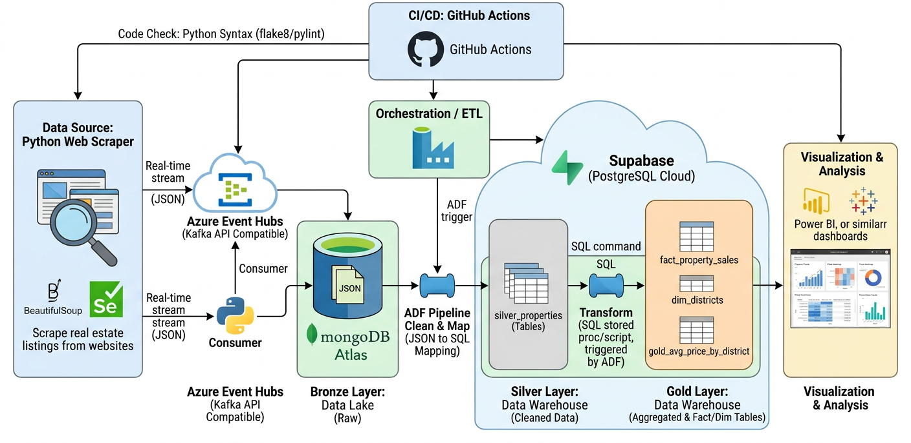

# VN Real Estate Data Platform 
## 🏗️ Architecture Overview


This project evolves a standard multi-site real estate web scraper into a fully-fledged, cloud-native **Data Pipeline**. Designed following the **Medallion Architecture**, the system focuses on highly scalable data ingestion, automated ETL/ELT orchestration, and strict data quality validation.


###  Core Components & Tech Stack

- **Data Ingestion (Scrapers):** Python-based scrapers (BeautifulSoup/Selenium) extracting property listings into unified JSON structures.
- **Streaming Layer:** **Azure Event Hubs** (Kafka-compatible) acts as a high-throughput message broker, decoupling the scrapers from the database to handle heavy parallel ingestion.
- **Data Lakehouse (Medallion Architecture):**
  - 🥉 **Bronze Layer (Raw Storage):** **MongoDB Atlas** stores raw, unstructured JSON documents exactly as scraped, preserving the original state for easy replayability.
  - 🥈 **Silver Layer (Cleaned Data):** **Supabase (PostgreSQL)** stores validated, deduplicated, and schema-enforced relational data.
  - 🥇 **Gold Layer (Analytics):** **Supabase (PostgreSQL)** houses aggregated Fact and Dimension tables (Star Schema) optimized for Business Intelligence (BI) dashboards.
- **Orchestration:** **Azure Data Factory (ADF)** manages the entire ETL/ELT lifecycle:
  - *Pipeline 1 (ETL):* Extracts data from MongoDB, applies deduplication/validation, and loads to Supabase (Silver).
  - *Pipeline 2 (ELT):* Triggers SQL Stored Procedures within Supabase to transform Silver data into Gold aggregated metrics.
- **CI/CD:** Automated testing, Python linting, and pipeline validation via **GitHub Actions**.

---

## End-to-End Data Flow

1. **Ingestion:** Scrapers constantly collect listings from major VN real estate portals (Batdongsan, Alonhadat, etc.). The raw data is instantly pushed to **Azure Event Hubs**, which buffers the high-velocity streams before landing them safely in **MongoDB Atlas** (Bronze).
2. **Bronze to Silver (ETL):** Azure Data Factory triggers a scheduled pipeline to pull new documents. The data undergoes schema validation and a strict deduplication process (removing reposts/spam listings) before being loaded into **Supabase Postgres**.
3. **Silver to Gold (ELT):** ADF triggers Stored Procedures directly in Postgres. Data is transformed into a Star Schema (e.g., `Dim_Location`, `Dim_Time`, `Fact_Listings`), ready for PowerBI or Tableau integration.

---

##  Project Structure

```text
vn-real-estate-data-platform/
├── config/                  # Cloud credentials (MongoDB, Azure) & Scraper settings
├── models/                  # Base schemas and data models
├── scrapers/                
│   ├── base/                # Base scraper classes
│   └── sources/             # Specific logic for batdongsan, alonhadat, etc.
├── utils/                   # Data Engineering Toolkit
│   ├── data_exporter.py     # Azure Event Hubs Producer client
│   ├── data_validator.py    # Schema validation engine
│   ├── deduplicator.py      # Cross-source deduplication logic
│   └── proxy_manager.py     # IP rotation for stable scraping
├── tests/                   # PyTest unit test suites
├── .github/workflows/       # CI/CD configurations
├── main.py                  # Entrypoint to trigger ingestion streams
└── requirements.txt         # Python dependencies
```
---

##  Quick Start (Docker) – Recommended

This is the easiest and most stable way to run the entire data pipeline. Docker handles Chromium and Kafka core dependencies (C-librdkafka) for you, ensuring a clean and consistent environment.

---

### 1. Environment Variables Configuration (`.env`)

Create a `.env` file in the root directory of the project (if it doesn’t exist) and add the following credentials:

```env
# AZURE EVENT HUBS CONFIG
EH_NAMESPACE=your-namespace.servicebus.windows.net:9093
TOPIC_NAME=your-topic-name
EH_CONNECTION_STRING=Endpoint=sb://your-namespace...
CONSUMER_GROUP=mongo-inserter-group

# MONGODB ATLAS CONFIG
MONGO_URI=mongodb+srv://<USER>:<PASS>@cluster0.mongodb.net/?retryWrites=true&w=majority
MONGO_DB=real_estate_db
MONGO_COLLECTION=listings_raw
````

---

### 2. Build Docker Images (Initialize the system)

```bash
docker-compose build
```

docker compose up --build


---

### 3. Run the Full System (Scraper + Consumer)

This command starts two background services:

* **Scraper (Producer):** Crawls real estate data and publishes it to Azure Event Hubs
* **Consumer:** Continuously reads data from Event Hubs and inserts it into MongoDB Atlas

```bash
docker-compose up -d
```

---

### 4. Monitor System Logs (Track Data Flow)

To monitor the scraper activity:

```bash
docker logs -f vn_real_estate_scraper
```

To monitor the consumer inserting data into MongoDB:

```bash
docker logs -f vn_real_estate_consumer
```

---

### 5. Stop All Services

```bash
docker-compose down
```

---

### 6. Run a Quick One-Off Scrape (Override Command)

If you don’t want to run the full system and just want to test a specific scraper (e.g., `raovat321`) and verify Event Hubs ingestion:

```bash
docker-compose run --rm real-estate-scraper python main.py --source raovat321 --max-pages 2
```

---


---

## Development & Local Setup (Without Docker)

While the core architecture relies on Cloud Managed Services, you can run the ingestion layer locally for development.

### 1. Prerequisites
* Python 3.11+
* Active accounts for MongoDB Atlas and Microsoft Azure (Event Hubs)

### 2. Installation

```bash
# Clone the repository
git clone https://github.com/your-username/vn-real-estate-data-platform.git
cd vn-real-estate-data-platform

# Create and activate virtual environment
python -m venv venv
source venv/bin/activate  # On Windows: venv\Scripts\activate

# Install dependencies
pip install -r requirements.txt
```

### 3. Configuration
Copy the configuration template and input your cloud connection strings:
```bash
cp config/config.example.py config/config.py
```
*Ensure you add your `EVENT_HUB_CONNECTION_STRING` and `MONGODB_ATLAS_URI`.*

### 4. Running the Ingestion Stream
Start the scraper and stream data directly to Azure Event Hubs:

```bash
# Run all configured sources
python main.py

# Run specific source with proxy rotation enabled
python main.py --source batdongsan --use-proxies
```

### 5. Testing
Run the automated test suite to ensure data validation and deduplication logic works as expected:
```bash
pytest tests/
```

---

## Raw Data Schema (Bronze Layer Example)

```json
{
    "_id": "ObjectId()",
    "source": "batdongsan.com.vn",
    "source_id": "bds-123456",
    "title": "Bán nhà mặt phố Quận 1",
    "price": {
        "amount": 15000000000,
        "currency": "VND",
        "unit": "total"
    },
    "location": {
        "district": "Quận 1",
        "city": "Hồ Chí Minh"
    },
    "features": {
        "area_sqm": 75.5,
        "bedrooms": 3,
        "floors": 4
    },
    "ingested_at": "2026-04-28T10:00:00Z"
}
```